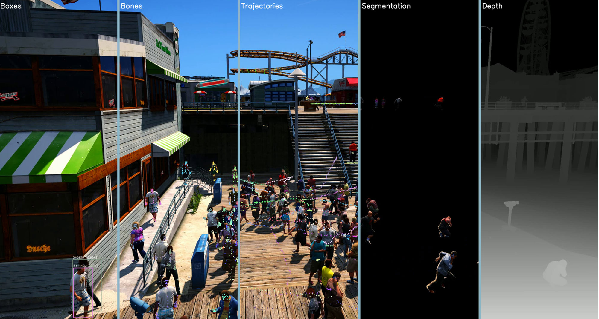

## Requirements
* GTAVisionNative (compile from source [here](https://github.com/umautobots/GTAVisionExport/tree/master/native) or download x64 [here](https://github.com/umautobots/GTAVisionExport/files/1703454/native64bit.zip))
* ScriptHookV (download [here](http://www.dev-c.com/gtav/scripthookv/))
* ScriptHookVDotNet V3 (download [here](https://github.com/crosire/scripthookvdotnet/releases))
* Menyoo GTA5 Trainer (download [here](https://www.gta5-mods.com/scripts/menyoo-pc-sp))
* VS2019
* others managed by Nuget

## Install:
```
git clone https://github.com/RicoMontulet/GTA5Event.git
```
- Open `GTA5Event.sln` in VS2019
- Right click GTA5Event in Solution Explorer: `properties -> Build Events` and in Post Build event command line add: `COPY "$(TargetPath)" "path/to/Grand Theft Auto V/Scripts"`
- Right click Solution 'GTA5Event' itself and go to: `properties -> Configuration Properties` and set the configuration to `Release` for `x64`
- Right click solution and click `Build Solution`

## Copying compiled files to GTA V
- After you compile the GTA5Event, copy compiled files from the `GTA5Event/bin/Release` to `path/to/Grand Theft Auto V/Scripts`.
- Modify the `gta_config.ini` file, update the directories + move the file to the `path/to/Grand Theft Auto V/Scripts`.

## Running GTA5 Event:
- Start the game
- Press "PageUp" to activate plugin 
- F3 to enter the free camera mode
- F10, F11 and F12 to change states of the plugin.
- Use Z to disable and enable ingame notifications (disable notifications before collecting data)

## Modify in-game settings:
- In Display
    - set Radar to Off
    - set HUD to Off
    - set game to Windowed mode
- In Graphics
    - set MSAA to Off
    - set Pause Game on Focus Loss to Off
    - set Frame Scaling to off
- In Notifications
    - set all notifications to Off

## State descriptions
### F10 Choose Locations:
When this state is active you can scout the game to find locations, using "[ ]" keys you can cycle through already existing locations. When you find a new location press "L" to save it, a popup will ask for a name so you can find it again later. Make sure these names are unique.

### F11 Choose Regions Of Interest:
When this state is active you can create a ROI for the currently selected location, ie use state F10 to select a location with "[ ]" keys and press F11. If you have a ROI saved already for the current location it will show you this in game. If not, you can use the mouse to position the sphere where you want a corner of the ROI to be. Use "U" to update the ROI (note: ROI is defined as a closed polygon). You can use "K" to remove the last corner point in case you messed up.

### F12 Record Data:
When this state is active it will put the camera in the first location and start the data collection process. It will automatically cycle through all available locations and make a new folder "locations_processed" where it will save a new json containing the FPS, cluster centers and locations of people. Make sure the game screen is in front of any other windows since screenshots are used for RGB data. It's best to now alt-tab out of the game (so you don't mouse the mouse accidentally) and leave the pc alone until it's done gathering data.

# !!!IMPORTANT!!! Use N to save all the locations before pressing F12 (game can crash during data collection)

## TLDR - Keymappings:
PageUp : Enable the plugin and load previously created scenes

- ANY STATE:
	- Z : toggle on and off in game notifications (disable notifications when collecting data)
	- N : Save all locations to disk
- F10:
	- L : Add new location, you will be promted for a name.
	- [ : Go to previous location
	- ] : Go to next location
- F11:
	- U : Update ROI polygon with the sphere's location
	- K : Remove last ROI point from current location


## APPENDIX:
### Stencil (bitmap):
- 0 : Environment objects like floor, stairs, buildings
- 1 : Persons
- 2 : Cars and trucks
- 3 : Waving flags, plants, trees
- 4 : Beach sand, grass
- 7 : sky

### Depth:
For more information on what the depth image contains exactly, please take a look [here](http://www.adriancourreges.com/blog/2015/11/02/gta-v-graphics-study/) and [here](https://www.groundai.com/project/precise-synthetic-image-and-lidar-presil-dataset-for-autonomous-vehicle-perception/1)

### Annotations:
The location json contains:
- location name
- camera position
- camera rotation
- player position
- player rotation
- ROI of the location
- PedGroups: contains the initial positions of all the people that belong to this group
- PedCenters: contains the original centers around which the people where spawned
- PedIdGroup: contains the handles of all the spawned peds, and the cluster center they belong to
- fps: frames per second the video was rendered at
- Action: the action that happens at frame 300
- Current time: is the time that the video was recorder in game time

The frame json contains:
- Currentweather: the weather of that scene [0=ExtraSunny, 1=Clear, 2=Clouds, 3=Smog, 5=Overcast, 6=Raining, 13=Snowing, 7=Thunderstorm]
- CamFOV: the field of view of the recording camera (always 50)
- Detections: List of all people in the scene with they type (1=person), distance to the camera in meters, their handle which is a unique id, and a list of their bones containing on-sceen relative x, y [0, 1] coordinates

### Aknowledgement
- Borrowing code from [umautobots](https://github.com/umautobots/GTAVisionExport)
- Thanks to [H2020 Mindspaces](https://mindspaces.eu/) for funding
- Publishing data from game according to [Rockstar Games](https://support.rockstargames.com/articles/200153756/Policy-on-posting-span-class-highlight-copyright-span-ed-Rockstar-Games-material)

### Citation
Please cite us :\)